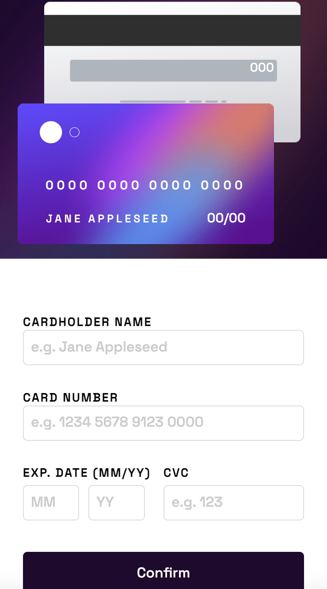

# Frontend Mentor - Interactive card details form solution

This is a solution to the [Interactive card details form challenge on Frontend Mentor](https://www.frontendmentor.io/challenges/interactive-card-details-form-XpS8cKZDWw). Frontend Mentor challenges help you improve your coding skills by building realistic projects. 

## Table of contents

- [Overview](#overview)
  - [The challenge](#the-challenge)
  - [Screenshot](#screenshot)
  - [Links](#links)
- [My process](#my-process)
  - [Built with](#built-with)
  - [What I learned](#what-i-learned)
  - [Continued development](#continued-development)
  - [Useful resources](#useful-resources)

**Note: Delete this note and update the table of contents based on what sections you keep.**

## Overview

### The challenge

Users should be able to:

- Fill in the form and see the card details update in real-time
- Receive error messages when the form is submitted if:
  - Any input field is empty
  - The card number, expiry date, or CVC fields are in the wrong format
- View the optimal layout depending on their device's screen size
- See hover, active, and focus states for interactive elements on the page

### Screenshot





### Links

- Solution URL: [Add solution URL here](https://your-solution-url.com)
- Live Site URL: [Add live site URL here](https://your-live-site-url.com)

## My process

### Built with
- vanilla JS
- Semantic HTML5 markup
- CSS custom properties
- Flexbox

### What I learned

Adding space after 4 numbers was interestingly fun to add and the 'input' event listener was new to me.

```js
const changeCardNumber = () => { 
    inputs[1].addEventListener('input', () => {
        let inputVal = inputs[1].value.replace(/[A-Za-z\s]/g, '');
        cardSixteen.innerText = inputs[1].value;
        let formatVal = '';

        for (let i = 0; i < inputVal.length; i++) {
            if (i % 4 === 0 && i > 0) {
                formatVal += ' ';
            }
            formatVal += inputVal[i];
        }
        inputs[1].value = formatVal;
       
    });
}
```

### Continued development

Adding validation on forms is pretty tough and would like to continue getting better at it. Esp. tackling edge cases that may arise.

### Useful resources

- [mdn input event](https://developer.mozilla.org/en-US/docs/Web/API/HTMLElement/input_event) - This helped me solve the text change upon text input on input field.

- Frontend Mentor - [@michaelr47](https://www.frontendmentor.io/profile/michaelr47)
